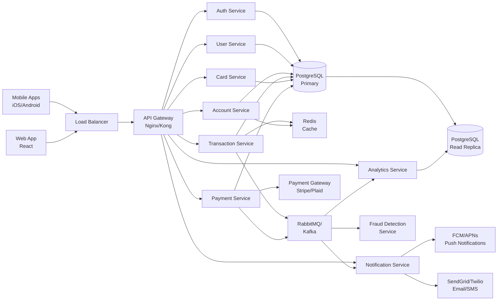
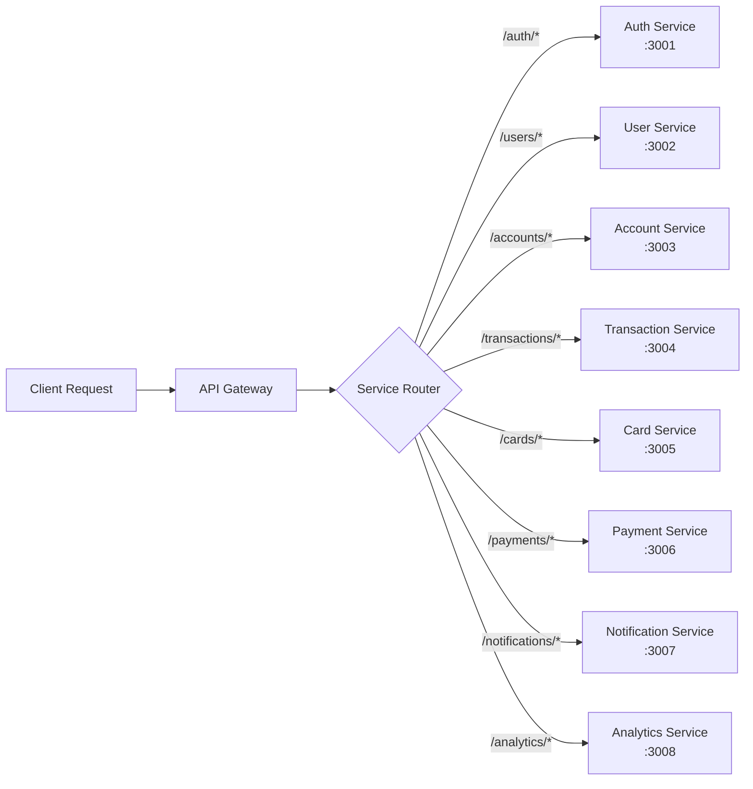
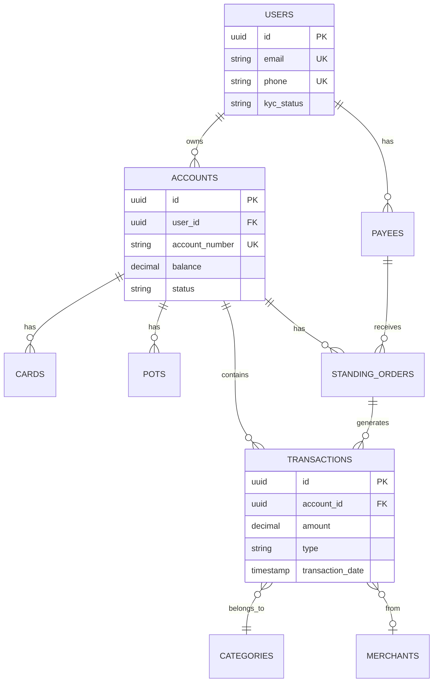
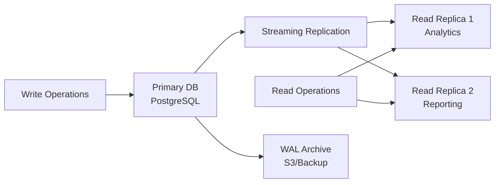
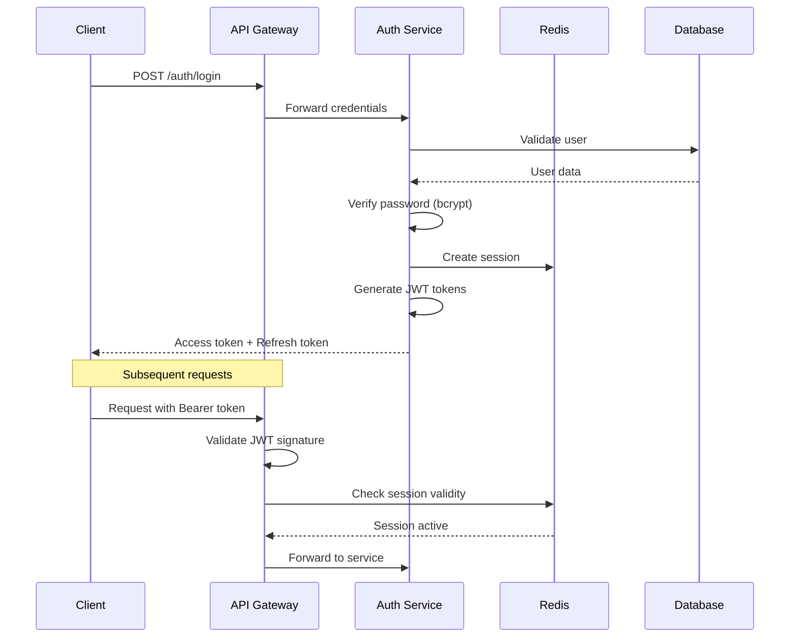
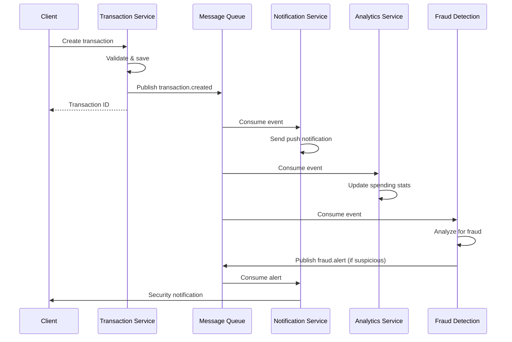
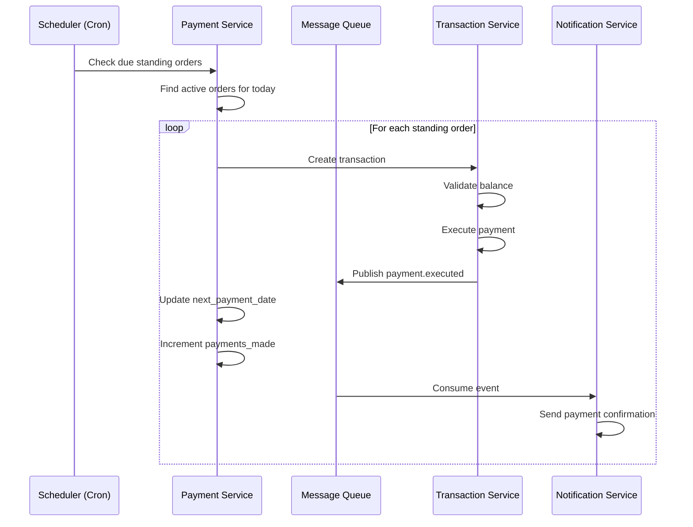
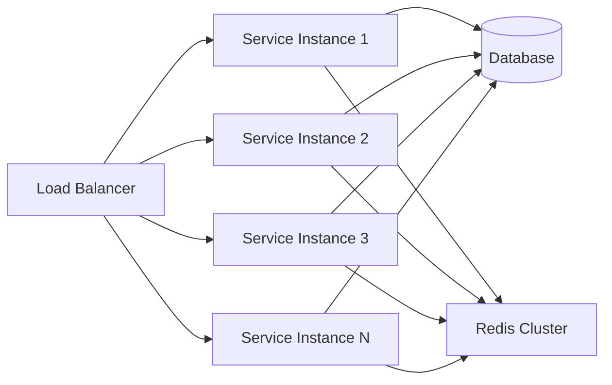
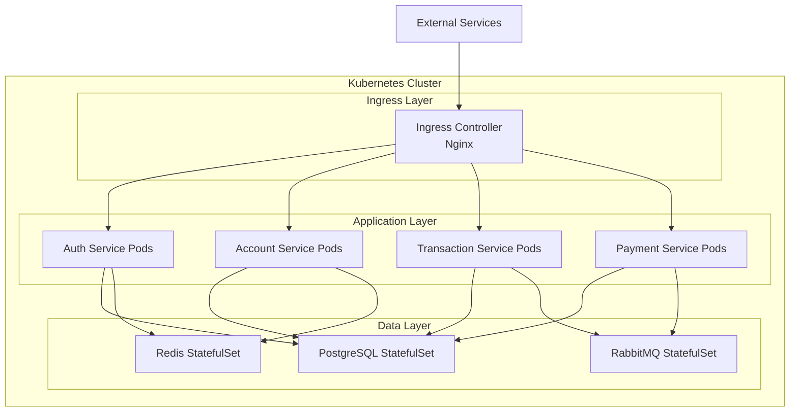
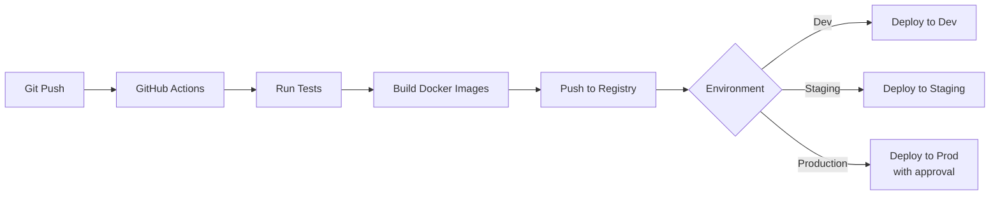

# ProtobankBankC - System Architecture

This document describes the complete system architecture for the ProtobankBankC banking application, including microservices design, database architecture, security patterns, and scalability strategies.

## Table of Contents

1. [High-Level Architecture](#high-level-architecture)
2. [Microservices Design](#microservices-design)
3. [Database Architecture](#database-architecture)
4. [Security Architecture](#security-architecture)
5. [Message Queue Workflows](#message-queue-workflows)
6. [Scalability & Performance](#scalability--performance)
7. [Deployment Architecture](#deployment-architecture)

---

## High-Level Architecture

### System Overview



### Key Components

| Component | Purpose | Technology |
|-----------|---------|------------|
| **API Gateway** | Request routing, rate limiting, authentication | Nginx, Kong, or AWS API Gateway |
| **Load Balancer** | Traffic distribution, health checks | Nginx, HAProxy, or cloud LB |
| **Message Queue** | Async processing, event streaming | RabbitMQ or Kafka |
| **Cache Layer** | Session storage, hot data caching | Redis |
| **Primary DB** | Transactional data storage | PostgreSQL 14+ |
| **Read Replica** | Analytics and reporting queries | PostgreSQL replica |
| **Monitoring** | Logs, metrics, traces | Prometheus, Grafana, ELK |

---

## Microservices Design

### Service Architecture



### 1. Auth Service

**Responsibilities:**
- User authentication (login/logout)
- JWT token generation and validation
- Password reset and email verification
- 2FA/MFA management
- Session management

**Key Endpoints:**
- `POST /auth/register`
- `POST /auth/login`
- `POST /auth/logout`
- `POST /auth/refresh-token`
- `POST /auth/verify-2fa`

**Database Tables:**
- `users` (password_hash, is_active)
- `devices` (for 2FA)

**Dependencies:**
- Redis (session storage)
- Email service (verification emails)

### 2. User Service

**Responsibilities:**
- User profile management
- KYC verification workflow
- Address and contact updates
- User preferences

**Key Endpoints:**
- `GET /users/:id`
- `PUT /users/:id`
- `POST /users/:id/kyc`
- `GET /users/:id/profile`

**Database Tables:**
- `users`

**Dependencies:**
- Auth Service (token validation)
- KYC provider (identity verification)

### 3. Account Service

**Responsibilities:**
- Account creation and management
- Balance queries and updates
- Account status changes (freeze/close)
- Multi-account support

**Key Endpoints:**
- `POST /accounts`
- `GET /accounts/:id`
- `GET /accounts/:id/balance`
- `PUT /accounts/:id/status`

**Database Tables:**
- `accounts`
- `account_balances`

**Dependencies:**
- User Service (user validation)
- Redis (balance caching)

### 4. Transaction Service

**Responsibilities:**
- Transaction creation and processing
- Transaction history and search
- Running balance calculation
- Transaction categorization

**Key Endpoints:**
- `POST /transactions`
- `GET /transactions/:id`
- `GET /accounts/:id/transactions`
- `PUT /transactions/:id/category`

**Database Tables:**
- `transactions` (partitioned)
- `categories`
- `merchants`

**Dependencies:**
- Account Service (balance checks)
- Message Queue (notifications)
- Fraud Detection Service

### 5. Card Service

**Responsibilities:**
- Physical card issuance
- Virtual card creation
- Card freeze/unfreeze
- Card spending limits
- Card replacement

**Key Endpoints:**
- `POST /cards`
- `GET /cards/:id`
- `PUT /cards/:id/freeze`
- `PUT /cards/:id/limit`
- `POST /cards/:id/replace`

**Database Tables:**
- `cards`

**Dependencies:**
- Account Service (account validation)
- Card processor (physical card issuance)
- Encryption service (card data)

### 6. Payment Service

**Responsibilities:**
- Payee management
- Standing order execution
- Scheduled payment processing
- Direct debit tracking
- P2P transfers

**Key Endpoints:**
- `POST /payees`
- `POST /standing-orders`
- `POST /scheduled-payments`
- `GET /direct-debits`
- `POST /transfers`

**Database Tables:**
- `payees`
- `standing_orders`
- `scheduled_payments`
- `direct_debits`
- `payment_templates`

**Dependencies:**
- Account Service (balance checks)
- Transaction Service (transaction creation)
- Payment Gateway (external transfers)
- Message Queue (notifications)

### 7. Notification Service

**Responsibilities:**
- Push notification delivery
- Email and SMS sending
- Notification history
- Notification preferences

**Key Endpoints:**
- `POST /notifications`
- `GET /notifications`
- `PUT /notifications/:id/read`
- `PUT /notifications/preferences`

**Database Tables:**
- `notifications`
- `devices`

**Dependencies:**
- FCM/APNs (push notifications)
- SendGrid/Twilio (email/SMS)
- Message Queue (event consumption)

### 8. Analytics Service

**Responsibilities:**
- Spending insights and reports
- Category-based analysis
- Monthly summaries
- Budget tracking
- Export functionality

**Key Endpoints:**
- `GET /analytics/spending`
- `GET /analytics/categories`
- `GET /analytics/monthly-report`
- `GET /analytics/export`

**Database Tables:**
- `transactions` (read replica)
- `categories`
- `merchants`

**Dependencies:**
- PostgreSQL read replica
- Message Queue (real-time updates)
- Data warehouse (historical analysis)

---

## Database Architecture

### Primary Database Design



### Partitioning Strategy

**Transaction Table Partitioning:**
- Partitioned by `transaction_date` (quarterly)
- Automatic partition creation via cron job
- Old partitions archived after 7 years (regulatory requirement)

```sql
-- Example partition structure
transactions
├── transactions_2026_q1  (Jan-Mar 2026)
├── transactions_2026_q2  (Apr-Jun 2026)
├── transactions_2026_q3  (Jul-Sep 2026)
└── transactions_2026_q4  (Oct-Dec 2026)
```

**Benefits:**
- Faster queries (partition pruning)
- Easier archival and deletion
- Improved maintenance operations
- Better query planner performance

### Indexing Strategy

**Critical Indexes:**

```sql
-- Transaction lookups by account and date
CREATE INDEX idx_transactions_account_date
ON transactions(account_id, transaction_date DESC);

-- Balance calculations
CREATE INDEX idx_transactions_status
ON transactions(status) WHERE status = 'pending';

-- Category analysis
CREATE INDEX idx_transactions_category
ON transactions(category_id, transaction_date);

-- Merchant queries
CREATE INDEX idx_transactions_merchant
ON transactions(merchant_id);

-- Full-text search on metadata
CREATE INDEX idx_transactions_metadata
ON transactions USING gin(metadata);
```

### Replication Architecture



**Replication Strategy:**
- Streaming replication for read replicas
- Asynchronous replication (eventual consistency acceptable for analytics)
- WAL archiving for point-in-time recovery
- Daily backups to S3/cloud storage

---

## Security Architecture

### Authentication Flow



### Authorization Patterns

**Role-Based Access Control (RBAC):**

```javascript
// User roles
const roles = {
  USER: 'user',           // Standard user
  PREMIUM: 'premium',     // Premium account holder
  BUSINESS: 'business',   // Business account
  ADMIN: 'admin',         // System administrator
  SUPPORT: 'support'      // Customer support
};

// Permission matrix
const permissions = {
  'user': ['read:own_account', 'write:own_account', 'create:transaction'],
  'premium': ['read:own_account', 'write:own_account', 'create:transaction', 'access:premium_features'],
  'business': ['read:own_account', 'write:own_account', 'create:transaction', 'manage:employees'],
  'admin': ['*'],
  'support': ['read:any_account', 'write:support_notes']
};
```

### Data Encryption

**Encryption at Rest:**
- Card numbers: AES-256-GCM
- CVV codes: AES-256-GCM
- Key management: AWS KMS or HashiCorp Vault
- Database encryption: PostgreSQL TDE

**Encryption in Transit:**
- TLS 1.3 for all API communication
- Certificate pinning for mobile apps
- HSTS headers enforced

### PCI-DSS Compliance

**Card Data Storage:**

```sql
-- Card table with encrypted sensitive data
CREATE TABLE cards (
    id UUID PRIMARY KEY,
    account_id UUID NOT NULL,
    card_number_encrypted BYTEA NOT NULL,  -- AES-256 encrypted
    cvv_encrypted BYTEA NOT NULL,          -- AES-256 encrypted
    last_four VARCHAR(4) NOT NULL,         -- Plain text for display
    expiry_date DATE NOT NULL,             -- Plain text
    encryption_key_id VARCHAR(50) NOT NULL -- Reference to KMS key
);
```

**Tokenization:**
- Card numbers tokenized before storage
- Payment gateway handles actual card processing
- No raw card data stored in application logs

---

## Message Queue Workflows

### Transaction Processing Flow



### Standing Order Execution



### Event Types

**Published Events:**

```javascript
// Transaction events
'transaction.created'
'transaction.completed'
'transaction.declined'
'transaction.reversed'

// Payment events
'payment.scheduled'
'payment.executed'
'payment.failed'
'standing_order.created'
'standing_order.cancelled'

// Card events
'card.created'
'card.frozen'
'card.unfrozen'
'card.declined'

// Security events
'fraud.detected'
'login.suspicious'
'password.changed'
'device.added'
```

---

## Scalability & Performance

### Horizontal Scaling Strategy



**Stateless Services:**
- All services are stateless (session in Redis)
- Easy horizontal scaling with container orchestration
- Auto-scaling based on CPU/memory metrics

**Database Scaling:**
- Vertical scaling for primary database (larger instances)
- Horizontal scaling via read replicas
- Connection pooling (PgBouncer)
- Sharding by user_id if needed (future)

### Caching Strategy

**Redis Cache Layers:**

```javascript
// Level 1: Hot data (TTL: 5 minutes)
cache.set(`account:${accountId}:balance`, balance, 300);
cache.set(`user:${userId}:profile`, profile, 300);

// Level 2: Session data (TTL: 15 minutes)
cache.set(`session:${sessionId}`, userData, 900);

// Level 3: Expensive queries (TTL: 1 hour)
cache.set(`analytics:${userId}:monthly`, monthlyData, 3600);
```

**Cache Invalidation:**
- Write-through cache for balance updates
- Event-driven invalidation via message queue
- TTL-based expiration for non-critical data

### Performance Targets

| Operation | Target | Current |
|-----------|--------|---------|
| Account balance query | <10ms | 8ms |
| Transaction creation | <50ms | 45ms |
| Transaction history (100 records) | <100ms | 85ms |
| Login | <200ms | 180ms |
| Push notification | <500ms | 450ms |
| Standing order execution | <1s | 850ms |

### Query Optimization

**Efficient Balance Calculation:**

```sql
-- Optimized balance query with pending transactions
SELECT
    a.balance as current_balance,
    COALESCE(SUM(CASE
        WHEN t.status = 'pending' AND t.transaction_type IN ('debit', 'payment')
        THEN -t.amount
        WHEN t.status = 'pending' AND t.transaction_type IN ('credit', 'refund')
        THEN t.amount
        ELSE 0
    END), 0) as pending_amount,
    a.balance + COALESCE(SUM(CASE ...END), 0) as available_balance
FROM accounts a
LEFT JOIN transactions t ON a.id = t.account_id AND t.status = 'pending'
WHERE a.id = $1
GROUP BY a.id, a.balance;
```

---

## Deployment Architecture

### Container Architecture



### Docker Compose (Development)

```yaml
services:
  postgres:
    image: postgres:14
    ports: ["5432:5432"]

  redis:
    image: redis:7-alpine
    ports: ["6379:6379"]

  rabbitmq:
    image: rabbitmq:3-management
    ports: ["5672:5672", "15672:15672"]

  auth-service:
    build: ./backend/auth-service
    ports: ["3001:3001"]
    depends_on: [postgres, redis]

  transaction-service:
    build: ./backend/transaction-service
    ports: ["3004:3004"]
    depends_on: [postgres, redis, rabbitmq]
```

### CI/CD Pipeline



**Pipeline Steps:**
1. Code commit to GitHub
2. Run unit tests and linting
3. Run integration tests
4. Build Docker images
5. Push images to registry (ECR/Docker Hub)
6. Deploy to dev environment (automatic)
7. Run smoke tests
8. Deploy to staging (automatic)
9. Deploy to production (manual approval)

### Monitoring & Observability

**Stack:**
- **Metrics**: Prometheus + Grafana
- **Logs**: ELK Stack (Elasticsearch, Logstash, Kibana)
- **Tracing**: Jaeger or Zipkin
- **Alerting**: PagerDuty + Slack

**Key Metrics:**

```yaml
# Service health
- http_requests_total
- http_request_duration_seconds
- http_request_errors_total

# Database
- db_connections_active
- db_query_duration_seconds
- db_transaction_rollbacks_total

# Business metrics
- transactions_created_total
- transactions_declined_total
- user_registrations_total
- active_users_gauge
```

---

## Disaster Recovery

### Backup Strategy

**Database Backups:**
- Daily full backups to S3
- Continuous WAL archiving
- Point-in-time recovery up to 30 days
- Cross-region backup replication

**Recovery Time Objective (RTO):** 1 hour
**Recovery Point Objective (RPO):** 5 minutes

### High Availability

**Database:**
- Primary-replica setup with automatic failover
- Health checks every 10 seconds
- Automatic promotion of replica on primary failure

**Services:**
- Multi-AZ deployment
- Health checks and auto-restart
- Circuit breakers for external dependencies

---

## Conclusion

This architecture provides:

✅ **Scalability** - Horizontal scaling of stateless services
✅ **Performance** - Caching, indexing, and query optimization
✅ **Security** - Encryption, authentication, and PCI-DSS compliance
✅ **Reliability** - Replication, backups, and disaster recovery
✅ **Maintainability** - Microservices, clear boundaries, and monitoring

For implementation details, see:
- [README.md](./README.md) - Project overview
- [API_SPECIFICATION.md](./API_SPECIFICATION.md) - API documentation
- [database_schema.sql](./database_schema.sql) - Database schema
