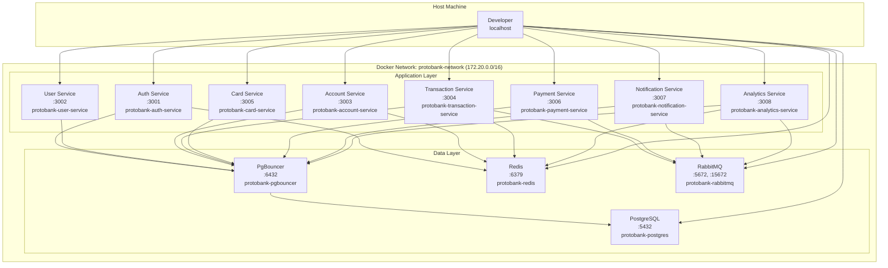
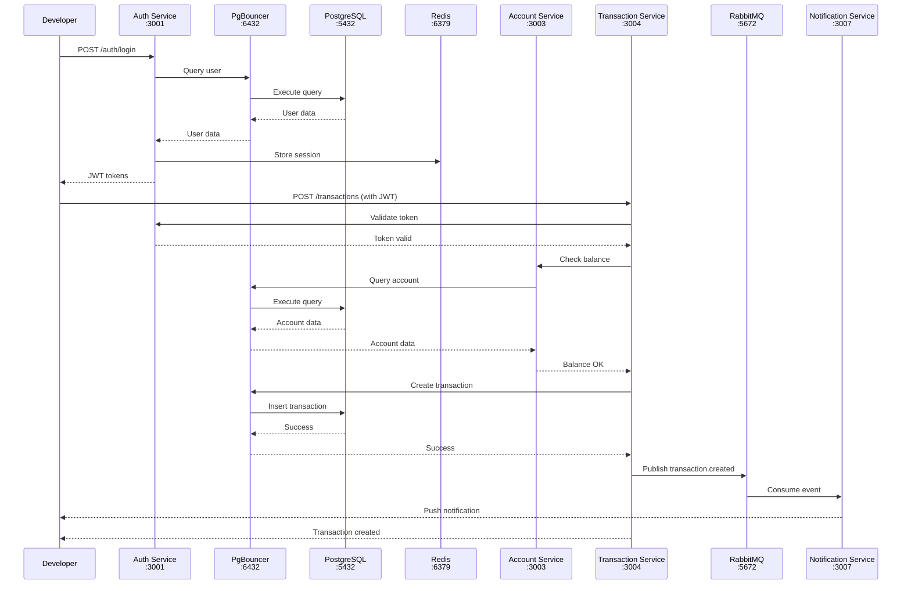

# ProtobankBankC - Development Setup Guide

Complete guide to setting up and running the Protobank development environment using Docker Compose.

## Table of Contents

1. [Prerequisites](#prerequisites)
2. [Quick Start](#quick-start)
3. [Docker Architecture](#docker-architecture)
4. [Detailed Setup](#detailed-setup)
5. [Service URLs](#service-urls)
6. [Common Commands](#common-commands)
7. [Troubleshooting](#troubleshooting)
8. [Development Workflow](#development-workflow)

---

## Prerequisites

### Required Software

| Software | Version | Installation |
|----------|---------|--------------|
| **Docker** | 20.10+ | [Get Docker](https://docs.docker.com/get-docker/) |
| **Docker Compose** | 2.0+ | Included with Docker Desktop |
| **Git** | 2.30+ | [Git Downloads](https://git-scm.com/downloads) |
| **Make** | 3.81+ | Pre-installed on macOS/Linux, [Windows](http://gnuwin32.sourceforge.net/packages/make.htm) |

### System Requirements

```
Minimum:
- RAM: 8 GB
- Disk: 20 GB free space
- CPU: 4 cores

Recommended:
- RAM: 16 GB
- Disk: 50 GB free space (SSD preferred)
- CPU: 8 cores
```

### Verify Installation

```bash
docker --version          # Docker version 24.0.0+
docker-compose --version  # Docker Compose version v2.20.0+
git --version            # git version 2.30.0+
make --version           # GNU Make 3.81+
```

---

## Quick Start

### 1. Clone the Repository

```bash
git clone <repository-url>
cd ProtobankBankC
```

### 2. Initialize Environment

```bash
make setup
```

This will:
- Copy `.env.example` to `.env`
- Make scripts executable
- Display next steps

### 3. Review Environment Variables

```bash
# Edit .env with your preferred editor
nano .env
# or
code .env
```

**For development, the defaults are usually fine!**

### 4. Start All Services

```bash
make up
```

This will:
- Download all Docker images
- Build service containers
- Initialize PostgreSQL database
- Start all microservices
- Set up networking

**First run takes 5-10 minutes** depending on internet speed.

### 5. Verify Services

```bash
make health
```

Expected output:
```
🏥 Health Check:

PostgreSQL:
  ✅ Healthy

Redis:
  ✅ Healthy

RabbitMQ:
  ✅ Healthy
```

### 6. View Logs

```bash
make logs
```

---

## Docker Architecture

### Container Network Topology



### Service Communication Flow



### Volume Mounts and Persistence

```
Host Machine                    Docker Container
─────────────                   ────────────────

postgres_data volume     →      /var/lib/postgresql/data
redis_data volume        →      /data
rabbitmq_data volume     →      /var/lib/rabbitmq

./database_schema.sql    →      /docker-entrypoint-initdb.d/01-schema.sql (read-only)
./scripts/init-db.sh     →      /docker-entrypoint-initdb.d/02-init.sh (read-only)
```

### Port Mappings

| Service | Container Port | Host Port | Description |
|---------|---------------|-----------|-------------|
| PostgreSQL | 5432 | 5432 | Database (direct access) |
| PgBouncer | 5432 | 6432 | Connection pooler |
| Redis | 6379 | 6379 | Cache & sessions |
| RabbitMQ | 5672 | 5672 | Message queue (AMQP) |
| RabbitMQ Management | 15672 | 15672 | Web UI |
| Auth Service | 3001 | 3001 | Authentication API |
| User Service | 3002 | 3002 | User management API |
| Account Service | 3003 | 3003 | Account management API |
| Transaction Service | 3004 | 3004 | Transaction API |
| Card Service | 3005 | 3005 | Card management API |
| Payment Service | 3006 | 3006 | Payment API |
| Notification Service | 3007 | 3007 | Notification API |
| Analytics Service | 3008 | 3008 | Analytics API |

---

## Detailed Setup

### Step 1: Project Structure

After setup, your project structure should look like this:

```
ProtobankBankC/
├── .env                           # Environment variables (created from .env.example)
├── .env.example                   # Environment template
├── .gitignore                     # Git ignore rules
├── docker-compose.yml             # Docker Compose configuration
├── Makefile                       # Development commands
├── README.md                      # Project overview
├── ARCHITECTURE.md                # System architecture
├── API_SPECIFICATION.md           # API documentation
├── TECH_STACK.md                  # Technology stack
├── DEVELOPMENT_SETUP.md           # This file
├── database_schema.sql            # PostgreSQL schema
├── backend/
│   ├── Dockerfile.template        # Go service Dockerfile template
│   ├── auth-service/              # Authentication microservice
│   ├── user-service/              # User management microservice
│   ├── account-service/           # Account management microservice
│   ├── transaction-service/       # Transaction processing microservice
│   ├── card-service/              # Card management microservice
│   ├── payment-service/           # Payment processing microservice
│   ├── notification-service/      # Notification microservice
│   └── analytics-service/         # Analytics microservice
├── frontend/
│   ├── mobile/                    # React Native mobile app
│   └── web/                       # React web app
├── scripts/
│   └── init-db.sh                 # Database initialization script
├── nginx/                         # Nginx configuration (optional)
├── monitoring/                    # Prometheus/Grafana configs (optional)
├── docs/
│   └── diagrams/                  # Architecture diagrams
└── infrastructure/
    ├── terraform/                 # Infrastructure as code
    └── kubernetes/                # K8s manifests
```

### Step 2: Environment Configuration

Edit `.env` to customize your setup:

```bash
# Database
POSTGRES_DB=protobank
POSTGRES_USER=postgres
POSTGRES_PASSWORD=postgres

# Redis
REDIS_PASSWORD=redis

# RabbitMQ
RABBITMQ_USER=admin
RABBITMQ_PASSWORD=admin

# Security (CHANGE THESE IN PRODUCTION!)
JWT_SECRET=change-this-secret-in-production
ENCRYPTION_KEY=change-this-32-byte-key-in-production
```

### Step 3: Starting Services

#### Option A: Using Make (Recommended)

```bash
# Start all services
make up

# View logs
make logs

# Check health
make health
```

#### Option B: Using Docker Compose Directly

```bash
# Start all services
docker-compose up -d

# View logs
docker-compose logs -f

# Check status
docker-compose ps
```

### Step 4: Database Initialization

The database is automatically initialized on first run with:
1. Schema from `database_schema.sql`
2. Seed data (17 default categories)

To manually reset the database:

```bash
make db-reset
```

⚠️ **Warning**: This deletes all data!

### Step 5: Verify Installation

#### Check Service Health

```bash
make health
```

#### Check Service Status

```bash
make status
```

Expected output:
```
NAME                              STATUS    PORTS
protobank-postgres                Up        0.0.0.0:5432->5432/tcp
protobank-pgbouncer               Up        0.0.0.0:6432->5432/tcp
protobank-redis                   Up        0.0.0.0:6379->6379/tcp
protobank-rabbitmq                Up        0.0.0.0:5672->5672/tcp, 0.0.0.0:15672->15672/tcp
protobank-auth-service            Up        0.0.0.0:3001->3001/tcp
protobank-user-service            Up        0.0.0.0:3002->3002/tcp
protobank-account-service         Up        0.0.0.0:3003->3003/tcp
protobank-transaction-service     Up        0.0.0.0:3004->3004/tcp
protobank-card-service            Up        0.0.0.0:3005->3005/tcp
protobank-payment-service         Up        0.0.0.0:3006->3006/tcp
protobank-notification-service    Up        0.0.0.0:3007->3007/tcp
protobank-analytics-service       Up        0.0.0.0:3008->3008/tcp
```

#### Test Database Connection

```bash
make db-connect
```

```sql
-- Once connected, run:
SELECT COUNT(*) FROM categories;
-- Expected: 17

\dt  -- List all tables
\q   -- Quit
```

#### Test Redis Connection

```bash
make redis-cli
```

```
redis-cli> PING
PONG
redis-cli> exit
```

#### Access RabbitMQ Management UI

Open browser to: http://localhost:15672

- Username: `admin`
- Password: `admin`

---

## Service URLs

### Microservices

| Service | URL | Swagger | Status |
|---------|-----|---------|--------|
| Auth Service | http://localhost:3001 | http://localhost:3001/swagger | 🔄 Pending |
| User Service | http://localhost:3002 | http://localhost:3002/swagger | 🔄 Pending |
| Account Service | http://localhost:3003 | http://localhost:3003/swagger | 🔄 Pending |
| Transaction Service | http://localhost:3004 | http://localhost:3004/swagger | 🔄 Pending |
| Card Service | http://localhost:3005 | http://localhost:3005/swagger | 🔄 Pending |
| Payment Service | http://localhost:3006 | http://localhost:3006/swagger | 🔄 Pending |
| Notification Service | http://localhost:3007 | http://localhost:3007/swagger | 🔄 Pending |
| Analytics Service | http://localhost:3008 | http://localhost:3008/swagger | 🔄 Pending |

### Infrastructure

| Service | URL | Credentials |
|---------|-----|-------------|
| PostgreSQL | `localhost:5432` | `postgres` / `postgres` |
| PgBouncer | `localhost:6432` | `postgres` / `postgres` |
| Redis | `localhost:6379` | Password: `redis` |
| RabbitMQ AMQP | `localhost:5672` | `admin` / `admin` |
| RabbitMQ Management | http://localhost:15672 | `admin` / `admin` |

---

## Common Commands

### Service Management

```bash
make up          # Start all services
make down        # Stop all services
make restart     # Restart all services
make rebuild     # Rebuild and restart
make status      # Show service status
make health      # Check service health
```

### Logs

```bash
make logs                 # All services
make logs-auth            # Auth service only
make logs-transaction     # Transaction service only
make logs-postgres        # PostgreSQL only
make logs-redis           # Redis only
make logs-rabbitmq        # RabbitMQ only
```

### Database

```bash
make db-connect    # Connect to PostgreSQL
make db-reset      # Reset database (WARNING: deletes data!)
make db-backup     # Backup to backup.sql
make db-restore    # Restore from backup.sql
```

### Utilities

```bash
make shell-postgres    # Open shell in PostgreSQL container
make shell-redis       # Open shell in Redis container
make redis-cli         # Connect to Redis CLI
make info              # Show project information
make help              # Show all commands
```

### Cleanup

```bash
make clean         # Remove containers and volumes
make clean-all     # Remove containers, volumes, and images
make prune         # Prune entire Docker system (careful!)
```

---

## Troubleshooting

### Services Won't Start

**Problem**: Container fails to start

```bash
# Check logs for specific service
make logs-<service-name>

# Example
make logs-postgres
```

**Common Solutions**:
- Port already in use: Change port in `.env`
- Insufficient resources: Close other applications
- Previous containers running: `make clean && make up`

### Database Connection Failed

**Problem**: Services can't connect to PostgreSQL

```bash
# Check PostgreSQL is healthy
make health

# Check PostgreSQL logs
make logs-postgres

# Verify connection
make db-connect
```

**Solutions**:
- Wait for PostgreSQL to fully start (30 seconds)
- Check credentials in `.env` match `docker-compose.yml`
- Restart PostgreSQL: `docker-compose restart postgres`

### Port Already in Use

**Problem**: `Error: bind: address already in use`

```bash
# Find process using port (macOS/Linux)
lsof -i :5432  # Replace with your port

# Kill the process
kill -9 <PID>

# Or change port in .env
POSTGRES_PORT=5433
```

### Out of Disk Space

```bash
# Check Docker disk usage
docker system df

# Clean up
make clean-all
docker system prune -af --volumes
```

### Slow Performance

**Solutions**:
1. Increase Docker memory (Docker Desktop → Settings → Resources)
2. Use SSD for Docker volumes
3. Close unnecessary applications
4. Disable services you don't need in `docker-compose.yml`

### Reset Everything

```bash
# Nuclear option: reset everything
make clean-all
rm .env
make setup
make up
```

---

## Development Workflow

### Daily Workflow

```bash
# 1. Start services
make up

# 2. Work on code
# Edit files in backend/, frontend/, etc.

# 3. View logs
make logs

# 4. Test changes
# Services auto-reload (if configured with volumes)

# 5. End of day
make down
```

### Feature Development Workflow

```bash
# 1. Create feature branch
git checkout -b feature/new-payment-flow

# 2. Start services
make up

# 3. Develop feature
# Edit code, test, iterate

# 4. Test database changes
make db-connect
# Test queries

# 5. Commit changes
git add .
git commit -m "Add new payment flow"

# 6. Push branch
git push origin feature/new-payment-flow
```

### Database Development

```bash
# 1. Backup current database
make db-backup

# 2. Make schema changes
# Edit database_schema.sql

# 3. Reset database with new schema
make db-reset

# 4. Test changes
make db-connect

# 5. If problems, restore backup
make db-restore
```

### Service Development

```bash
# 1. Start all services
make up

# 2. Stop service you're working on
docker-compose stop auth-service

# 3. Run service locally for debugging
cd backend/auth-service
go run cmd/server/main.go

# 4. Test and develop

# 5. Restart in Docker
docker-compose start auth-service
```

---

## Next Steps

1. **Build Services**: Start implementing Go microservices
2. **API Testing**: Use Postman or curl to test endpoints
3. **Frontend**: Build React Native mobile app
4. **CI/CD**: Set up GitHub Actions
5. **Production**: Deploy to Kubernetes

---

## Resources

- [Docker Documentation](https://docs.docker.com/)
- [Docker Compose Documentation](https://docs.docker.com/compose/)
- [PostgreSQL Documentation](https://www.postgresql.org/docs/)
- [Redis Documentation](https://redis.io/documentation)
- [RabbitMQ Documentation](https://www.rabbitmq.com/documentation.html)

---

## Support

For issues or questions:
- Check [Troubleshooting](#troubleshooting) section
- Review logs: `make logs`
- Check service health: `make health`
- Create GitHub issue with logs and error details

---

**Last Updated**: 2026-01-30
**Version**: 1.0.0
