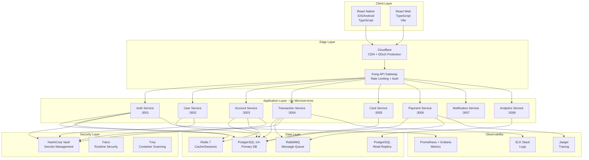

# ProtobankBankC - Technology Stack

Complete technology stack documentation for the Monzo clone banking application, with security as the foundational principle.

## Table of Contents

1. [Stack Overview](#stack-overview)
2. [Backend](#backend)
3. [Frontend](#frontend)
4. [Database & Data Layer](#database--data-layer)
5. [Infrastructure](#infrastructure)
6. [Security](#security)
7. [Monitoring & Observability](#monitoring--observability)
8. [Development Tools](#development-tools)
9. [Compliance & Certifications](#compliance--certifications)
10. [Cost Estimates](#cost-estimates)
11. [Implementation Timeline](#implementation-timeline)

---

## Stack Overview



### Technology Selection Criteria

All technology choices prioritize:

1. **Security** - Memory safety, type safety, minimal attack surface
2. **Performance** - Low latency for financial transactions
3. **Reliability** - Battle-tested in production banking environments
4. **Maintainability** - Clear code, strong typing, good tooling
5. **Compliance** - PCI-DSS, SOC 2, ISO 27001 ready

---

## Backend

### Primary Language: Go (Golang) 1.21+

**Why Go for Banking Applications:**

✅ **Security Advantages:**
- **Memory safety** - Automatic garbage collection, no buffer overflows
- **Type safety** - Strong static typing catches errors at compile time
- **Standard crypto library** - Battle-tested `crypto/*` package
- **Minimal dependencies** - Reduced third-party vulnerability surface
- **Static binaries** - No runtime dependencies to exploit
- **Built-in concurrency** - Safe concurrent operations with channels

✅ **Performance Benefits:**
- **Fast execution** - Compiled language with near-C performance
- **Low latency** - Sub-millisecond response times achievable
- **Efficient concurrency** - Goroutines handle 10,000+ concurrent requests
- **Small memory footprint** - ~25MB per service vs 200MB+ for Node.js
- **Fast startup** - Critical for auto-scaling and recovery

✅ **Industry Adoption:**
- **Monzo** - Entire backend written in Go
- **American Express** - Payment processing systems
- **Capital One** - Core banking services
- **PayPal** - High-throughput payment services
- **Stripe** - API infrastructure

✅ **Developer Experience:**
- **Simple syntax** - Easy to learn, hard to misuse
- **Great tooling** - Built-in formatter, linter, test runner
- **Fast compilation** - Seconds for entire microservice
- **Excellent documentation** - Clear, comprehensive standard library docs

### Go Stack Components

```go
// HTTP Framework
github.com/gin-gonic/gin                 // High-performance HTTP framework
// Alternative: github.com/gofiber/fiber  // Even faster, Fastify-like API

// Database
github.com/jackc/pgx/v5                  // PostgreSQL driver (fastest)
github.com/kyleconroy/sqlc               // Compile-time verified SQL
// Alternative: github.com/volatiletech/sqlboiler

// Validation
github.com/go-playground/validator/v10   // Struct validation
github.com/go-ozzo/ozzo-validation       // Flexible validation

// Security
github.com/golang-jwt/jwt/v5             // JWT token generation/validation
golang.org/x/crypto/bcrypt               // Password hashing
crypto/aes                               // AES encryption (standard library)
crypto/rand                              // Cryptographically secure random

// Redis
github.com/redis/go-redis/v9             // Redis client
github.com/go-redis/redis_rate/v10       // Rate limiting

// Message Queue
github.com/rabbitmq/amqp091-go           // RabbitMQ client

// Configuration
github.com/spf13/viper                   // Config management
github.com/joho/godotenv                 // .env file support

// Logging
github.com/sirupsen/logrus               // Structured logging
// Alternative: go.uber.org/zap           // Faster logging

// Testing
github.com/stretchr/testify              // Test assertions
github.com/golang/mock                   // Mocking framework
github.com/DATA-DOG/go-sqlmock           // SQL mocking

// Monitoring
github.com/prometheus/client_golang      // Prometheus metrics

// Documentation
github.com/swaggo/swag                   // Swagger/OpenAPI generation
```

### Service Template Structure

```
auth-service/
├── cmd/
│   └── server/
│       └── main.go              # Application entry point
├── internal/
│   ├── config/
│   │   └── config.go            # Configuration loading
│   ├── handlers/
│   │   ├── auth_handler.go      # HTTP handlers
│   │   └── auth_handler_test.go
│   ├── models/
│   │   └── user.go              # Data models
│   ├── repository/
│   │   ├── user_repository.go   # Database access layer
│   │   └── queries.sql          # SQL queries for sqlc
│   ├── services/
│   │   └── auth_service.go      # Business logic
│   ├── middleware/
│   │   ├── auth.go              # JWT validation
│   │   └── rate_limit.go        # Rate limiting
│   └── utils/
│       ├── crypto.go            # Encryption utilities
│       └── validators.go        # Custom validators
├── pkg/
│   └── errors/
│       └── errors.go            # Custom error types
├── migrations/
│   ├── 001_create_users.up.sql
│   └── 001_create_users.down.sql
├── docs/
│   └── swagger.yaml             # API documentation
├── go.mod
├── go.sum
├── Dockerfile
├── .env.example
└── README.md
```

### Alternative: Rust

**Consider Rust if:**
- Maximum security is paramount (memory safety without garbage collection)
- Performance requirements are extreme (< 1ms p99 latency)
- Team has Rust expertise

**Trade-offs:**
- Steeper learning curve
- Slower development velocity
- Smaller ecosystem
- Harder to hire developers

**Rust Stack:**
```rust
// Framework
actix-web or axum               // High-performance web frameworks

// Database
sqlx                            // Async SQL toolkit

// Serialization
serde                           // Serialization framework
```

---

## Frontend

### Mobile: React Native 0.73+ with TypeScript 5.0+

**Why React Native:**

✅ **Cross-platform Development:**
- Single codebase for iOS and Android
- ~90% code sharing between platforms
- Native performance for critical operations
- Access to native modules when needed

✅ **Industry Adoption:**
- **Coinbase** - Crypto banking app
- **Revolut** - Digital banking (partially)
- **Shopify** - E-commerce platform
- **Microsoft** - Office mobile apps

✅ **Security Features:**
- React Native Keychain - Secure credential storage
- Native biometric APIs (Face ID, Touch ID, fingerprint)
- Certificate pinning support
- Code obfuscation tools

✅ **Developer Experience:**
- Hot reload for fast iteration
- Large ecosystem of libraries
- Strong TypeScript support
- Excellent debugging tools

### Mobile Tech Stack

```typescript
// Core
react-native: ^0.73.0
react: ^18.2.0
typescript: ^5.0.0

// Navigation
@react-navigation/native: ^6.x
@react-navigation/stack: ^6.x
@react-navigation/bottom-tabs: ^6.x

// State Management
@tanstack/react-query: ^5.x       // Server state
zustand: ^4.x                     // Client state
// Alternative: Redux Toolkit     // More complex apps

// UI Components
react-native-paper: ^5.x          // Material Design
// Alternative: NativeBase         // Component library

// Forms
react-hook-form: ^7.x             // Form handling
zod: ^3.x                         // Schema validation

// Security
react-native-keychain: ^8.x       // Secure storage
react-native-biometrics: ^3.x     // Biometric auth
react-native-ssl-pinning: ^2.x    // Certificate pinning

// Networking
axios: ^1.x                       // HTTP client
react-native-encrypted-storage: ^4.x

// Push Notifications
@react-native-firebase/messaging: ^18.x
@notifee/react-native: ^7.x

// Analytics & Monitoring
@sentry/react-native: ^5.x        // Error tracking
react-native-device-info: ^10.x   // Device information

// Testing
jest: ^29.x
@testing-library/react-native: ^12.x
detox: ^20.x                      // E2E testing

// Development
react-native-debugger: ^0.x
reactotron-react-native: ^5.x
```

### Mobile Project Structure

```
mobile/
├── src/
│   ├── components/
│   │   ├── common/
│   │   │   ├── Button.tsx
│   │   │   ├── Input.tsx
│   │   │   └── Card.tsx
│   │   └── features/
│   │       ├── transactions/
│   │       └── cards/
│   ├── screens/
│   │   ├── auth/
│   │   │   ├── LoginScreen.tsx
│   │   │   └── RegisterScreen.tsx
│   │   ├── home/
│   │   │   └── HomeScreen.tsx
│   │   └── account/
│   │       └── AccountScreen.tsx
│   ├── navigation/
│   │   ├── AuthNavigator.tsx
│   │   └── MainNavigator.tsx
│   ├── services/
│   │   ├── api.ts
│   │   ├── auth.ts
│   │   └── storage.ts
│   ├── hooks/
│   │   ├── useAuth.ts
│   │   └── useTransactions.ts
│   ├── store/
│   │   └── authStore.ts
│   ├── types/
│   │   └── index.ts
│   └── utils/
│       ├── formatters.ts
│       └── validators.ts
├── android/
├── ios/
├── __tests__/
├── e2e/
├── .env.example
├── app.json
├── package.json
├── tsconfig.json
└── README.md
```

### Web: React 18+ with TypeScript 5.0+

**Why React for Web:**

✅ **Mature Ecosystem:**
- Largest component library ecosystem
- Excellent TypeScript support
- Strong security tooling
- Great performance with modern features

✅ **Security:**
- Built-in XSS protection
- Content Security Policy support
- Sanitization libraries

### Web Tech Stack

```typescript
// Core
react: ^18.2.0
typescript: ^5.0.0
vite: ^5.x                        // Build tool (faster than webpack)

// Routing
react-router-dom: ^6.x

// State Management
@tanstack/react-query: ^5.x
zustand: ^4.x

// UI Framework
tailwindcss: ^3.x                 // Utility-first CSS
@headlessui/react: ^1.x           // Unstyled components
// Alternative: MUI or Chakra UI

// Forms
react-hook-form: ^7.x
zod: ^3.x

// HTTP Client
axios: ^1.x

// Security
dompurify: ^3.x                   // XSS sanitization
helmet: ^7.x                      // Security headers (server-side)

// Charts & Visualization
recharts: ^2.x                    // Spending analytics
date-fns: ^2.x                    // Date formatting

// Testing
vitest: ^1.x                      // Unit tests (faster than Jest)
@testing-library/react: ^14.x
playwright: ^1.x                  // E2E testing

// Development
eslint: ^8.x
prettier: ^3.x
@vitejs/plugin-react: ^4.x
```

### Web Project Structure

```
web/
├── src/
│   ├── components/
│   ├── pages/
│   ├── hooks/
│   ├── services/
│   ├── store/
│   ├── types/
│   ├── utils/
│   └── App.tsx
├── public/
├── tests/
├── .env.example
├── index.html
├── package.json
├── tsconfig.json
├── vite.config.ts
└── tailwind.config.js
```

---

## Database & Data Layer

### Primary Database: PostgreSQL 14+

**Why PostgreSQL for Banking:**

✅ **ACID Compliance:**
- Atomicity - All-or-nothing transactions
- Consistency - Data integrity constraints
- Isolation - Concurrent transaction safety
- Durability - Committed data survives crashes

✅ **Security Features:**
- Row-level security (RLS) for multi-tenancy
- Encryption at rest (TDE)
- SSL/TLS connections
- Audit logging (pgAudit)
- Role-based access control

✅ **Performance:**
- JSONB for flexible metadata
- Partitioning for large tables
- Materialized views for analytics
- Parallel query execution

✅ **Banking Industry Standard:**
- Used by major financial institutions
- 30+ years of development
- ANSI SQL compliant
- Extensive financial functions

### Database Stack

```yaml
Database:
  - PostgreSQL: 14.10 or later

Connection Pooling:
  - PgBouncer: ^1.21

Extensions:
  - pgcrypto: UUID generation, encryption
  - pg_stat_statements: Query performance monitoring
  - pg_partman: Partition management
  - pgaudit: Audit logging
  - timescaledb: Time-series data (optional, for analytics)

Backup & Recovery:
  - pgBackRest: Backup management
  - WAL-G: Alternative backup tool
  - Point-in-time recovery (PITR)

Migration Tools:
  - golang-migrate/migrate: Go migration tool
  - Alternative: Flyway
```

### Caching: Redis 7

**Why Redis:**

✅ **Use Cases:**
- Session storage (JWT refresh tokens)
- Rate limiting counters
- Cache frequently accessed data (account balances)
- Pub/Sub for real-time notifications
- Distributed locks

✅ **Features:**
- In-memory speed (sub-millisecond latency)
- Persistence options (RDB + AOF)
- Atomic operations
- Lua scripting for complex operations
- Redis Cluster for high availability

```yaml
Redis:
  - Version: 7.2+
  - Deployment: Redis Sentinel (HA) or Redis Cluster
  - Persistence: RDB snapshots + AOF log
  - Max memory policy: allkeys-lru
```

### Message Queue: RabbitMQ 3.12+

**Why RabbitMQ:**

✅ **Reliability:**
- Message acknowledgments
- Durable queues
- Dead letter exchanges (DLX)
- Message TTL
- Publisher confirms

✅ **Banking Use Cases:**
- Transaction notifications
- Standing order execution
- Scheduled payment processing
- Fraud detection alerts
- Analytics event streaming

**Alternative: Apache Kafka**

Consider Kafka if:
- Need to process millions of events per second
- Require event sourcing architecture
- Long-term event log storage needed

```yaml
RabbitMQ:
  - Version: 3.12+
  - Deployment: 3-node cluster
  - High availability: Mirrored queues
  - Plugins: Management, Federation

Kafka (alternative):
  - Version: 3.6+
  - Use case: Event sourcing, high throughput
  - Complexity: Higher operational overhead
```

---

## Infrastructure

### Development: Docker Compose

**Why Docker Compose for Development:**

✅ **Benefits:**
- Consistent environment across team
- Easy service orchestration
- Fast setup (one command)
- No local PostgreSQL/Redis installation needed

### Production: Kubernetes

**Why Kubernetes:**

✅ **Features:**
- Auto-scaling (HPA)
- Self-healing
- Rolling updates
- Service discovery
- Secrets management
- Network policies

✅ **Managed Options:**
- AWS EKS
- Google GKE
- Azure AKS
- DigitalOcean Kubernetes

```yaml
Infrastructure Stack:

Containerization:
  - Docker: 24.x

Orchestration:
  - Kubernetes: 1.28+
  - Helm: 3.x (package manager)

Infrastructure as Code:
  - Terraform: 1.6+
  - Alternative: Pulumi

Service Mesh (optional):
  - Istio or Linkerd
  - Use case: Advanced traffic management

API Gateway:
  - Kong: 3.x
  - Alternative: Traefik, AWS API Gateway

Load Balancer:
  - Nginx: 1.24+
  - Alternative: HAProxy, cloud provider LB

CDN:
  - Cloudflare
  - Alternative: AWS CloudFront, Fastly
```

---

## Security

### Secrets Management: HashiCorp Vault

**Why Vault:**

✅ **Features:**
- Dynamic secrets generation
- Secret rotation
- Encryption as a service
- Audit logging
- Fine-grained access control

```yaml
Secrets Management:
  - HashiCorp Vault: 1.15+
  - Alternative: AWS Secrets Manager, Azure Key Vault

Key Management:
  - HashiCorp Vault KMS
  - Alternative: AWS KMS, Google Cloud KMS
```

### Encryption

```yaml
At Rest:
  - Database: PostgreSQL TDE
  - Files: AES-256-GCM
  - Backups: Encrypted with KMS

In Transit:
  - TLS 1.3 minimum
  - Certificate: Let's Encrypt or commercial CA
  - Mobile: Certificate pinning

Sensitive Fields:
  - Card numbers: AES-256-GCM + tokenization
  - CVV: AES-256-GCM (never stored long-term)
  - SSN/Tax IDs: AES-256-GCM
  - PII: Column-level encryption
```

### Authentication & Authorization

```yaml
Authentication:
  - JWT tokens (access: 15 min, refresh: 7 days)
  - Password hashing: bcrypt (cost factor 12)
  - 2FA: TOTP (RFC 6238)
  - Biometrics: Device native APIs

Authorization:
  - RBAC (Role-Based Access Control)
  - Policy enforcement: OPA (Open Policy Agent)
```

### Security Scanning

```yaml
SAST (Static Analysis):
  - Gosec: Go code security scanner
  - Semgrep: Multi-language analysis
  - SonarQube: Code quality + security

Dependency Scanning:
  - Snyk: Vulnerability detection
  - Dependabot: Automated updates
  - OWASP Dependency-Check

Container Scanning:
  - Trivy: Container vulnerability scanner
  - Clair: Alternative scanner
  - Anchore: Policy-based scanning

Runtime Security:
  - Falco: Runtime threat detection
  - Alternative: Sysdig
```

### WAF (Web Application Firewall)

```yaml
WAF:
  - Cloudflare WAF
  - Alternative: AWS WAF, ModSecurity

DDoS Protection:
  - Cloudflare
  - Rate limiting at API gateway
  - Application-level rate limiting
```

---

## Monitoring & Observability

### Metrics: Prometheus + Grafana

**Why Prometheus:**

✅ **Features:**
- Time-series database
- Pull-based metrics collection
- PromQL query language
- Alerting rules

```yaml
Metrics Stack:
  - Prometheus: 2.48+
  - Grafana: 10.x
  - Alertmanager: 0.26+

Exporters:
  - Node Exporter: System metrics
  - PostgreSQL Exporter: Database metrics
  - Redis Exporter: Cache metrics
```

### Logging: ELK Stack

```yaml
Logging Stack:
  - Elasticsearch: 8.x
  - Logstash: 8.x
  - Kibana: 8.x
  - Filebeat: 8.x (log shipping)

Alternative:
  - Loki + Grafana (lighter weight)
  - Cloud options: AWS CloudWatch, Datadog
```

### Distributed Tracing: Jaeger

```yaml
Tracing:
  - Jaeger: 1.50+
  - Alternative: Zipkin, AWS X-Ray

OpenTelemetry:
  - OTEL SDK: Multi-vendor observability
```

### APM (Application Performance Monitoring)

```yaml
APM Options:
  - New Relic
  - Datadog
  - Elastic APM (open source)
  - Sentry (error tracking)
```

### Alerting

```yaml
Critical Alerts:
  - PagerDuty: On-call management
  - Opsgenie: Alternative

Notifications:
  - Slack: Warning alerts
  - Email: Non-critical alerts
  - SMS: Critical only
```

---

## Development Tools

### Version Control

```yaml
Git Hosting:
  - GitHub
  - Alternative: GitLab, Bitbucket

Branching Strategy:
  - Git Flow or Trunk-based development
  - Protected main branch
  - Required code reviews
```

### CI/CD

```yaml
CI/CD Platform:
  - GitHub Actions
  - Alternative: GitLab CI, CircleCI, Jenkins

Pipeline Stages:
  1. Lint & format check
  2. Unit tests
  3. Security scanning (SAST)
  4. Build Docker images
  5. Integration tests
  6. Push to registry
  7. Deploy to dev (auto)
  8. Deploy to staging (auto)
  9. Deploy to prod (manual approval)

Quality Gates:
  - Code coverage > 80%
  - Security scan pass
  - Performance benchmarks pass
  - Manual approval for production
```

### Code Quality

```yaml
Go:
  - golangci-lint: Aggregated linter
  - gofmt: Code formatting
  - go vet: Static analysis

TypeScript:
  - ESLint: Linting
  - Prettier: Formatting
  - TypeScript compiler: Type checking

Git Hooks:
  - pre-commit: Lint + format
  - pre-push: Tests
  - Husky: Git hooks management
```

### API Documentation

```yaml
Documentation:
  - Swagger/OpenAPI 3.0
  - Redoc: Alternative API docs
  - Postman Collections: API testing

Generation:
  - swaggo/swag: Go Swagger generator
  - TypeScript: ts-to-openapi
```

---

## Compliance & Certifications

### Required for Production Banking

```yaml
PCI-DSS (Payment Card Industry):
  - Level: Depends on transaction volume
  - Requirements:
    - Encrypted card data storage
    - Network segmentation
    - Regular security audits
    - Penetration testing

ISO 27001:
  - Information Security Management
  - Certification cost: $10k-50k
  - Annual audits

SOC 2 Type II:
  - Security, availability, confidentiality
  - Audit duration: 6-12 months
  - Cost: $20k-100k

GDPR (EU):
  - Data protection regulation
  - Right to deletion
  - Data portability
  - Consent management

Financial Regulations:
  - FCA (UK): Financial Conduct Authority
  - FinCEN (US): Financial Crimes Enforcement
  - Basel III: Bank capital requirements
```

### Security Best Practices

```yaml
Penetration Testing:
  - Frequency: Quarterly minimum
  - Scope: Full application + infrastructure
  - Cost: $15k-50k per test

Bug Bounty Program:
  - Platform: HackerOne, Bugcrowd
  - Start after initial security hardening

Security Audits:
  - Code audit: Before launch
  - Infrastructure audit: Before launch
  - Ongoing: Annual reviews
```

---

## Cost Estimates

### Development Phase (Team of 5)

```yaml
Infrastructure (Monthly):
  - AWS/GCP/Azure: $500-1,000
  - GitHub Enterprise: $200 (optional)
  - Development tools: $200
  - Staging environment: $500
  Total: ~$1,500-2,000/month

Tools & Services:
  - Sentry (error tracking): $26-100/month
  - Datadog (monitoring): $0 (free tier) to $500
  - Security scanning: $0 (open source tools)
```

### Production Phase (Small Scale)

```yaml
Infrastructure (Monthly):
  - Kubernetes cluster: $1,000-2,000
  - Databases (managed): $500-1,500
  - Load balancers: $200-500
  - Object storage: $100-300
  - CDN: $100-500
  - Total: $2,000-5,000/month

Monitoring & Security:
  - APM (New Relic/Datadog): $500-1,000
  - Log management: $500-1,000
  - Security tools: $1,000-2,000
  - Total: $2,000-4,000/month

Third-party Services:
  - SMS/Email: $500-1,000
  - Push notifications: $100-500
  - Payment gateway: Variable (transaction fees)
  - Total: $600-1,500/month

Grand Total: $4,600-10,500/month
```

### Scaling Costs (10,000+ users)

```yaml
Infrastructure: $10,000-20,000/month
Monitoring: $5,000-10,000/month
Security: $2,000-5,000/month
Third-party: $5,000-15,000/month

Total: $22,000-50,000/month
```

---

## Implementation Timeline

### Phase 1: Foundation (Months 1-2)

```yaml
Infrastructure:
  - Set up Kubernetes cluster
  - Configure CI/CD pipeline
  - Set up monitoring & logging
  - Configure secrets management

Services:
  - Auth Service (register, login, 2FA)
  - User Service (profile, KYC)

Tasks:
  - Docker Compose setup
  - Database schema deployment
  - API gateway configuration
  - Security hardening
```

### Phase 2: Core Banking (Months 3-4)

```yaml
Services:
  - Account Service (CRUD, balance)
  - Transaction Service (create, list, categorize)
  - Card Service (issue, freeze, limits)

Tasks:
  - Payment gateway integration
  - Fraud detection system
  - Real-time notifications
```

### Phase 3: Payments (Months 5-6)

```yaml
Services:
  - Payment Service (payees, standing orders, scheduled payments)
  - Analytics Service (spending insights)

Tasks:
  - Direct debit support
  - P2P transfers
  - Budget tracking
```

### Phase 4: Mobile Apps (Months 7-8)

```yaml
Mobile Development:
  - React Native app structure
  - Authentication flow
  - Account & transaction screens
  - Card management
  - Payment flows

Tasks:
  - Push notifications
  - Biometric authentication
  - Offline support
  - App store submission
```

### Phase 5: Testing & Launch (Months 9-12)

```yaml
Security:
  - Penetration testing
  - Security audit
  - Bug bounty program

Testing:
  - Load testing
  - Stress testing
  - User acceptance testing

Compliance:
  - PCI-DSS certification
  - SOC 2 preparation
  - Privacy policy & T&Cs

Launch:
  - Beta testing (100 users)
  - Soft launch (1,000 users)
  - Public launch
```

---

## Summary

### Recommended Stack

| Layer | Technology | Why |
|-------|------------|-----|
| **Backend** | Go 1.21+ | Security, performance, simplicity |
| **Mobile** | React Native + TypeScript | Cross-platform, native performance |
| **Web** | React + TypeScript + Vite | Mature ecosystem, security |
| **Database** | PostgreSQL 14+ | ACID, security, banking standard |
| **Cache** | Redis 7 | Speed, reliability |
| **Queue** | RabbitMQ 3.12+ | Reliability, message guarantees |
| **Container** | Docker + Kubernetes | Industry standard, scalability |
| **Secrets** | HashiCorp Vault | Dynamic secrets, audit logs |
| **Monitoring** | Prometheus + Grafana | Open source, powerful |
| **Logging** | ELK Stack | Centralized, searchable logs |
| **CI/CD** | GitHub Actions | Integrated, free tier |

### Key Principles

1. **Security First** - Every technology choice prioritizes security
2. **Type Safety** - Go + TypeScript catch errors at compile time
3. **Performance** - Sub-millisecond latencies achievable
4. **Reliability** - Battle-tested technologies
5. **Compliance Ready** - PCI-DSS, SOC 2, ISO 27001
6. **Cost Effective** - Start small, scale as needed
7. **Developer Experience** - Great tooling, fast feedback

### Next Steps

1. Set up Docker Compose for local development
2. Scaffold Auth Service in Go
3. Create React Native mobile app structure
4. Configure CI/CD pipeline
5. Implement security best practices

---

**Document Version:** 1.0
**Last Updated:** 2026-01-30
**Maintained By:** ProtobankBankC Team
