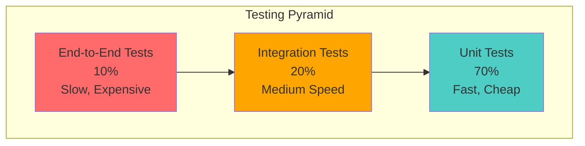
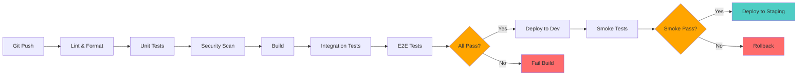

# ProtobankBankC - Testing Strategy

Comprehensive testing strategy for building a secure, reliable banking application with multiple layers of testing.

## Table of Contents

1. [Testing Philosophy](#testing-philosophy)
2. [Test Pyramid](#test-pyramid)
3. [Unit Testing](#unit-testing)
4. [Integration Testing](#integration-testing)
5. [Security Testing](#security-testing)
6. [Performance Testing](#performance-testing)
7. [Accessibility Testing](#accessibility-testing)
8. [End-to-End Testing](#end-to-end-testing)
9. [Test Coverage Requirements](#test-coverage-requirements)
10. [Testing Tools](#testing-tools)
11. [CI/CD Testing Pipeline](#cicd-testing-pipeline)
12. [Testing Checklist](#testing-checklist)

---

## Testing Philosophy

### Core Principles

1. **Test-Driven Development (TDD)** - Write tests before implementation
2. **Security First** - Security tests are mandatory, not optional
3. **Shift Left** - Catch issues as early as possible
4. **Automation** - All tests run automatically in CI/CD
5. **Fast Feedback** - Tests should run quickly and provide clear feedback
6. **Comprehensive Coverage** - Minimum 80% code coverage required

### Testing Goals

- ✅ **Correctness** - Code works as expected
- ✅ **Security** - No vulnerabilities or security holes
- ✅ **Performance** - Meets performance requirements
- ✅ **Reliability** - Services are resilient and fault-tolerant
- ✅ **Maintainability** - Tests are clear and easy to maintain
- ✅ **Accessibility** - Frontend meets WCAG 2.1 AA standards

---

## Test Pyramid



### Distribution

| Test Type | Percentage | Speed | Cost | Coverage |
|-----------|-----------|-------|------|----------|
| **Unit Tests** | 70% | ⚡ Fast (< 1s) | 💰 Low | Code logic, functions |
| **Integration Tests** | 20% | 🐢 Medium (1-10s) | 💰💰 Medium | Service interactions, DB |
| **E2E Tests** | 10% | 🐌 Slow (10s+) | 💰💰💰 High | Complete user flows |

---

## Unit Testing

### What to Test

```go
// Example: Password hashing unit test
func TestHashPassword(t *testing.T) {
    tests := []struct {
        name     string
        password string
        wantErr  bool
    }{
        {
            name:     "valid password",
            password: "SecurePass123!",
            wantErr:  false,
        },
        {
            name:     "empty password",
            password: "",
            wantErr:  true,
        },
        {
            name:     "very long password",
            password: strings.Repeat("a", 73), // bcrypt max is 72
            wantErr:  true,
        },
    }

    for _, tt := range tests {
        t.Run(tt.name, func(t *testing.T) {
            hash, err := HashPassword(tt.password)

            if (err != nil) != tt.wantErr {
                t.Errorf("HashPassword() error = %v, wantErr %v", err, tt.wantErr)
                return
            }

            if !tt.wantErr {
                assert.NotEmpty(t, hash)
                assert.NotEqual(t, tt.password, hash)

                // Verify hash is valid
                err = bcrypt.CompareHashAndPassword([]byte(hash), []byte(tt.password))
                assert.NoError(t, err)
            }
        })
    }
}
```

### Unit Test Coverage

**Required Coverage**: 80% minimum per service

**What to Cover**:
- ✅ Business logic functions
- ✅ Utility functions
- ✅ Validation functions
- ✅ Data transformations
- ✅ Error handling
- ✅ Edge cases
- ✅ Boundary conditions

**What NOT to Unit Test**:
- ❌ External dependencies (mock these)
- ❌ Framework code
- ❌ Simple getters/setters
- ❌ Database queries (integration tests)

### Go Testing Tools

```go
import (
    "testing"
    "github.com/stretchr/testify/assert"
    "github.com/stretchr/testify/mock"
    "github.com/stretchr/testify/suite"
)

// Table-driven tests
func TestValidateEmail(t *testing.T) {
    tests := []struct {
        name    string
        email   string
        wantErr bool
    }{
        {"valid email", "user@example.com", false},
        {"missing @", "userexample.com", true},
        {"empty", "", true},
    }

    for _, tt := range tests {
        t.Run(tt.name, func(t *testing.T) {
            err := ValidateEmail(tt.email)
            if (err != nil) != tt.wantErr {
                t.Errorf("got %v, want error: %v", err, tt.wantErr)
            }
        })
    }
}

// Mocking example
type MockUserRepository struct {
    mock.Mock
}

func (m *MockUserRepository) GetUser(id string) (*User, error) {
    args := m.Called(id)
    return args.Get(0).(*User), args.Error(1)
}

func TestAuthService_Login(t *testing.T) {
    mockRepo := new(MockUserRepository)
    mockRepo.On("GetUser", "user-id").Return(&User{ID: "user-id"}, nil)

    service := NewAuthService(mockRepo)
    user, err := service.GetUserByID("user-id")

    assert.NoError(t, err)
    assert.Equal(t, "user-id", user.ID)
    mockRepo.AssertExpectations(t)
}
```

### Running Unit Tests

```bash
# Run all unit tests
go test ./... -v

# Run with coverage
go test ./... -cover -coverprofile=coverage.out

# View coverage report
go tool cover -html=coverage.out

# Run specific package
go test ./internal/services -v

# Run with race detector
go test ./... -race

# Benchmark tests
go test ./... -bench=. -benchmem
```

---

## Integration Testing

### What to Test

Integration tests verify that services work together correctly:

- ✅ Database operations
- ✅ Redis caching
- ✅ RabbitMQ messaging
- ✅ Service-to-service communication
- ✅ External API calls

### Test Database

```go
// Use testcontainers for real database testing
import (
    "github.com/testcontainers/testcontainers-go"
    "github.com/testcontainers/testcontainers-go/wait"
)

func setupTestDB(t *testing.T) (*sql.DB, func()) {
    ctx := context.Background()

    req := testcontainers.ContainerRequest{
        Image:        "postgres:14-alpine",
        ExposedPorts: []string{"5432/tcp"},
        Env: map[string]string{
            "POSTGRES_DB":       "protobank_test",
            "POSTGRES_USER":     "test",
            "POSTGRES_PASSWORD": "test",
        },
        WaitingFor: wait.ForLog("database system is ready to accept connections"),
    }

    postgres, err := testcontainers.GenericContainer(ctx, testcontainers.GenericContainerRequest{
        ContainerRequest: req,
        Started:          true,
    })
    require.NoError(t, err)

    host, _ := postgres.Host(ctx)
    port, _ := postgres.MappedPort(ctx, "5432")

    dsn := fmt.Sprintf("postgres://test:test@%s:%s/protobank_test?sslmode=disable", host, port.Port())
    db, err := sql.Open("postgres", dsn)
    require.NoError(t, err)

    // Run migrations
    runMigrations(db)

    cleanup := func() {
        db.Close()
        postgres.Terminate(ctx)
    }

    return db, cleanup
}

func TestUserRepository_CreateUser(t *testing.T) {
    db, cleanup := setupTestDB(t)
    defer cleanup()

    repo := NewUserRepository(db)

    user := &User{
        Email:     "test@example.com",
        FirstName: "John",
        LastName:  "Doe",
    }

    err := repo.CreateUser(user)
    assert.NoError(t, err)
    assert.NotEmpty(t, user.ID)

    // Verify user was created
    retrieved, err := repo.GetUserByEmail("test@example.com")
    assert.NoError(t, err)
    assert.Equal(t, user.Email, retrieved.Email)
}
```

### API Integration Tests

```go
func TestAuthAPI_Login(t *testing.T) {
    // Setup test server
    router := setupRouter()
    server := httptest.NewServer(router)
    defer server.Close()

    // Test data
    payload := map[string]string{
        "email":    "user@example.com",
        "password": "SecurePass123!",
    }

    body, _ := json.Marshal(payload)

    // Make request
    resp, err := http.Post(
        server.URL+"/auth/login",
        "application/json",
        bytes.NewBuffer(body),
    )

    require.NoError(t, err)
    defer resp.Body.Close()

    // Assert response
    assert.Equal(t, http.StatusOK, resp.StatusCode)

    var result map[string]interface{}
    json.NewDecoder(resp.Body).Decode(&result)

    assert.NotEmpty(t, result["access_token"])
    assert.NotEmpty(t, result["refresh_token"])
}
```

### Message Queue Testing

```go
func TestNotificationService_PublishEvent(t *testing.T) {
    // Start test RabbitMQ
    rabbitmq, cleanup := setupTestRabbitMQ(t)
    defer cleanup()

    publisher := NewEventPublisher(rabbitmq)
    consumer := NewEventConsumer(rabbitmq)

    // Setup consumer
    received := make(chan Event, 1)
    consumer.Subscribe("transaction.created", func(event Event) {
        received <- event
    })

    // Publish event
    event := Event{
        Type: "transaction.created",
        Data: map[string]interface{}{
            "transaction_id": "txn-123",
            "amount":         100.50,
        },
    }

    err := publisher.Publish(event)
    assert.NoError(t, err)

    // Wait for event
    select {
    case e := <-received:
        assert.Equal(t, event.Type, e.Type)
        assert.Equal(t, event.Data["transaction_id"], e.Data["transaction_id"])
    case <-time.After(5 * time.Second):
        t.Fatal("timeout waiting for event")
    }
}
```

---

## Security Testing

### SAST (Static Application Security Testing)

```yaml
# .golangci.yml
linters:
  enable:
    - gosec        # Security checker
    - gocritic     # Code quality
    - gocyclo      # Cyclomatic complexity
    - dupl         # Code duplication
    - misspell     # Spelling
    - unparam      # Unused parameters
    - staticcheck  # Static analysis

linters-settings:
  gosec:
    severity: medium
    confidence: medium
    excludes:
      - G104  # Allow unhandled errors in specific cases
```

**Run Security Scans**:

```bash
# Install gosec
go install github.com/securego/gosec/v2/cmd/gosec@latest

# Run security scan
gosec ./...

# With JSON output
gosec -fmt=json -out=results.json ./...

# Check for specific issues
gosec -include=G401,G501 ./...  # Check for weak crypto
```

### Dependency Scanning

```bash
# Install govulncheck
go install golang.org/x/vuln/cmd/govulncheck@latest

# Scan for vulnerabilities
govulncheck ./...

# Check specific package
go list -m -json all | govulncheck -json -
```

### Security Test Cases

```go
func TestPasswordSecurity(t *testing.T) {
    tests := []struct {
        name     string
        password string
        wantErr  bool
        reason   string
    }{
        {
            name:     "weak password",
            password: "12345",
            wantErr:  true,
            reason:   "too short",
        },
        {
            name:     "no uppercase",
            password: "lowercase123!",
            wantErr:  true,
            reason:   "missing uppercase",
        },
        {
            name:     "no numbers",
            password: "LowercaseUpper!",
            wantErr:  true,
            reason:   "missing numbers",
        },
        {
            name:     "no special chars",
            password: "LowercaseUpper123",
            wantErr:  true,
            reason:   "missing special characters",
        },
        {
            name:     "strong password",
            password: "SecurePass123!",
            wantErr:  false,
        },
    }

    for _, tt := range tests {
        t.Run(tt.name, func(t *testing.T) {
            err := ValidatePasswordStrength(tt.password)
            if (err != nil) != tt.wantErr {
                t.Errorf("expected error: %v, got: %v (reason: %s)", tt.wantErr, err, tt.reason)
            }
        })
    }
}

func TestJWTTokenSecurity(t *testing.T) {
    t.Run("token expiration", func(t *testing.T) {
        token := GenerateToken("user-123", time.Now().Add(-1*time.Hour))

        _, err := ValidateToken(token)
        assert.Error(t, err)
        assert.Contains(t, err.Error(), "expired")
    })

    t.Run("invalid signature", func(t *testing.T) {
        token := "eyJhbGciOiJIUzI1NiIsInR5cCI6IkpXVCJ9.eyJzdWIiOiIxMjM0NTY3ODkwIn0.invalid"

        _, err := ValidateToken(token)
        assert.Error(t, err)
    })

    t.Run("tampered payload", func(t *testing.T) {
        token := GenerateToken("user-123", time.Now().Add(1*time.Hour))

        // Tamper with token
        parts := strings.Split(token, ".")
        parts[1] = "tamperedpayload"
        tamperedToken := strings.Join(parts, ".")

        _, err := ValidateToken(tamperedToken)
        assert.Error(t, err)
    })
}

func TestSQLInjectionPrevention(t *testing.T) {
    db, cleanup := setupTestDB(t)
    defer cleanup()

    repo := NewUserRepository(db)

    // SQL injection attempt
    maliciousEmail := "admin' OR '1'='1"

    user, err := repo.GetUserByEmail(maliciousEmail)

    // Should return nil user, not all users
    assert.NoError(t, err)
    assert.Nil(t, user)
}

func TestXSSPrevention(t *testing.T) {
    router := setupRouter()
    server := httptest.NewServer(router)
    defer server.Close()

    // XSS attempt
    payload := map[string]string{
        "first_name": "<script>alert('XSS')</script>",
        "last_name":  "Doe",
    }

    body, _ := json.Marshal(payload)
    resp, err := http.Post(server.URL+"/users", "application/json", bytes.NewBuffer(body))

    require.NoError(t, err)
    defer resp.Body.Close()

    var result map[string]interface{}
    json.NewDecoder(resp.Body).Decode(&result)

    // Should be sanitized
    assert.NotContains(t, result["first_name"], "<script>")
}
```

### Penetration Testing

```bash
# Install OWASP ZAP
docker pull owasp/zap2docker-stable

# Run baseline scan
docker run -v $(pwd):/zap/wrk/:rw \
  owasp/zap2docker-stable zap-baseline.py \
  -t http://localhost:3001 \
  -r zap-report.html

# Run full scan
docker run -v $(pwd):/zap/wrk/:rw \
  owasp/zap2docker-stable zap-full-scan.py \
  -t http://localhost:3001 \
  -r zap-report.html
```

---

## Performance Testing

### Load Testing

```go
func BenchmarkAuthService_Login(b *testing.B) {
    service := setupAuthService()

    b.ResetTimer()
    for i := 0; i < b.N; i++ {
        _, err := service.Login("user@example.com", "password")
        if err != nil {
            b.Fatal(err)
        }
    }
}

func BenchmarkTransactionService_Create(b *testing.B) {
    service := setupTransactionService()

    transaction := &Transaction{
        AccountID: "acc-123",
        Amount:    100.50,
        Type:      "debit",
    }

    b.ResetTimer()
    for i := 0; i < b.N; i++ {
        _, err := service.CreateTransaction(transaction)
        if err != nil {
            b.Fatal(err)
        }
    }
}
```

### Stress Testing

```bash
# Install k6
brew install k6

# Run load test
k6 run load-test.js

# With custom VUs and duration
k6 run --vus 100 --duration 30s load-test.js
```

**k6 Script Example**:

```javascript
// load-test.js
import http from 'k6/http';
import { check, sleep } from 'k6';

export let options = {
  stages: [
    { duration: '1m', target: 100 },   // Ramp up to 100 users
    { duration: '3m', target: 100 },   // Stay at 100 users
    { duration: '1m', target: 200 },   // Ramp up to 200 users
    { duration: '3m', target: 200 },   // Stay at 200 users
    { duration: '1m', target: 0 },     // Ramp down
  ],
  thresholds: {
    'http_req_duration': ['p(95)<500'],  // 95% of requests < 500ms
    'http_req_failed': ['rate<0.01'],    // Less than 1% failures
  },
};

export default function() {
  // Login
  let loginRes = http.post('http://localhost:3001/auth/login', JSON.stringify({
    email: 'user@example.com',
    password: 'SecurePass123!',
  }), {
    headers: { 'Content-Type': 'application/json' },
  });

  check(loginRes, {
    'login status is 200': (r) => r.status === 200,
    'login has token': (r) => r.json('access_token') !== '',
  });

  let token = loginRes.json('access_token');

  // Get account balance
  let balanceRes = http.get('http://localhost:3003/accounts/acc-123/balance', {
    headers: { 'Authorization': `Bearer ${token}` },
  });

  check(balanceRes, {
    'balance status is 200': (r) => r.status === 200,
  });

  sleep(1);
}
```

---

## Accessibility Testing

### Frontend Accessibility

**WCAG 2.1 AA Compliance Required**

```typescript
// Example: React component accessibility tests
import { render, screen } from '@testing-library/react';
import { axe, toHaveNoViolations } from 'jest-axe';

expect.extend(toHaveNoViolations);

describe('LoginForm Accessibility', () => {
  it('should not have accessibility violations', async () => {
    const { container } = render(<LoginForm />);
    const results = await axe(container);
    expect(results).toHaveNoViolations();
  });

  it('should have proper labels', () => {
    render(<LoginForm />);

    expect(screen.getByLabelText('Email')).toBeInTheDocument();
    expect(screen.getByLabelText('Password')).toBeInTheDocument();
  });

  it('should be keyboard navigable', () => {
    render(<LoginForm />);

    const emailInput = screen.getByLabelText('Email');
    const passwordInput = screen.getByLabelText('Password');
    const submitButton = screen.getByRole('button', { name: 'Login' });

    // Tab order
    emailInput.focus();
    expect(document.activeElement).toBe(emailInput);

    // Press Tab
    userEvent.tab();
    expect(document.activeElement).toBe(passwordInput);

    userEvent.tab();
    expect(document.activeElement).toBe(submitButton);
  });

  it('should have proper ARIA attributes', () => {
    render(<LoginForm />);

    const form = screen.getByRole('form');
    expect(form).toHaveAttribute('aria-label', 'Login form');

    const emailInput = screen.getByLabelText('Email');
    expect(emailInput).toHaveAttribute('aria-required', 'true');
  });

  it('should announce errors to screen readers', async () => {
    render(<LoginForm />);

    const submitButton = screen.getByRole('button', { name: 'Login' });
    userEvent.click(submitButton);

    await waitFor(() => {
      const errorMessage = screen.getByRole('alert');
      expect(errorMessage).toHaveTextContent('Email is required');
      expect(errorMessage).toHaveAttribute('aria-live', 'polite');
    });
  });
});
```

### Automated Accessibility Testing

```bash
# Install Pa11y
npm install -g pa11y

# Run accessibility test
pa11y http://localhost:3000

# With specific standard
pa11y --standard WCAG2AA http://localhost:3000

# Test multiple URLs
pa11y-ci --sitemap http://localhost:3000/sitemap.xml
```

---

## End-to-End Testing

### E2E Testing with Playwright

```typescript
// tests/e2e/auth.spec.ts
import { test, expect } from '@playwright/test';

test.describe('Authentication Flow', () => {
  test('should register, login, and access dashboard', async ({ page }) => {
    // 1. Register
    await page.goto('http://localhost:3000/register');
    await page.fill('[name="email"]', 'newuser@example.com');
    await page.fill('[name="password"]', 'SecurePass123!');
    await page.fill('[name="firstName"]', 'John');
    await page.fill('[name="lastName"]', 'Doe');
    await page.click('button[type="submit"]');

    await expect(page).toHaveURL('/verify-email');

    // 2. Login
    await page.goto('http://localhost:3000/login');
    await page.fill('[name="email"]', 'newuser@example.com');
    await page.fill('[name="password"]', 'SecurePass123!');
    await page.click('button[type="submit"]');

    await expect(page).toHaveURL('/dashboard');

    // 3. Verify dashboard loads
    await expect(page.locator('h1')).toContainText('Dashboard');
    await expect(page.locator('[data-testid="account-balance"]')).toBeVisible();
  });

  test('should handle payment flow', async ({ page }) => {
    await loginAsUser(page);

    // Navigate to payments
    await page.click('[data-testid="payments-nav"]');
    await expect(page).toHaveURL('/payments');

    // Create payment
    await page.click('[data-testid="new-payment-button"]');
    await page.selectOption('[name="payee"]', 'payee-123');
    await page.fill('[name="amount"]', '100.50');
    await page.fill('[name="reference"]', 'Test payment');
    await page.click('button[type="submit"]');

    // Verify confirmation
    await expect(page.locator('[data-testid="payment-success"]')).toBeVisible();
    await expect(page.locator('[data-testid="payment-success"]'))
      .toContainText('£100.50');
  });
});
```

---

## Test Coverage Requirements

### Minimum Coverage Targets

| Component | Unit Tests | Integration Tests | E2E Tests | Security Tests |
|-----------|-----------|------------------|-----------|----------------|
| **Auth Service** | 85% | ✅ Required | ✅ Required | ✅ Required |
| **Payment Service** | 85% | ✅ Required | ✅ Required | ✅ Required |
| **Transaction Service** | 80% | ✅ Required | ✅ Required | ✅ Required |
| **Other Services** | 80% | ✅ Required | Optional | ✅ Required |
| **Frontend** | 70% | Optional | ✅ Required | ✅ Required |

### Quality Gates

```yaml
# .github/workflows/quality-gates.yml
quality_gates:
  code_coverage:
    minimum: 80%
    target: 90%

  security:
    gosec: must_pass
    govulncheck: must_pass
    snyk: high_severity_max_0

  performance:
    p95_latency: 500ms
    error_rate: 1%

  accessibility:
    wcag_level: AA
    violations: 0
```

---

## Testing Tools

### Backend (Go)

```go
// go.mod testing dependencies
require (
    github.com/stretchr/testify v1.8.4       // Assertions and mocking
    github.com/golang/mock v1.6.0            // Mock generation
    github.com/testcontainers/testcontainers-go v0.26.0  // Docker containers
    github.com/DATA-DOG/go-sqlmock v1.5.0    // SQL mocking
    github.com/go-redis/redismock/v9 v9.2.0  // Redis mocking
    github.com/securego/gosec/v2 v2.18.2     // Security scanner
)
```

### Frontend (React/React Native)

```json
{
  "devDependencies": {
    "@testing-library/react": "^14.0.0",
    "@testing-library/react-native": "^12.0.0",
    "@testing-library/jest-native": "^5.4.0",
    "@testing-library/user-event": "^14.5.0",
    "jest-axe": "^8.0.0",
    "playwright": "^1.40.0",
    "detox": "^20.0.0"
  }
}
```

---

## CI/CD Testing Pipeline



### GitHub Actions Workflow

```yaml
# .github/workflows/test.yml
name: Test Suite

on: [push, pull_request]

jobs:
  lint:
    runs-on: ubuntu-latest
    steps:
      - uses: actions/checkout@v4
      - uses: actions/setup-go@v5
        with:
          go-version: '1.21'
      - name: golangci-lint
        uses: golangci/golangci-lint-action@v3

  unit-tests:
    runs-on: ubuntu-latest
    needs: lint
    steps:
      - uses: actions/checkout@v4
      - uses: actions/setup-go@v5
      - name: Run unit tests
        run: |
          go test ./... -v -race -coverprofile=coverage.out
          go tool cover -func=coverage.out
      - name: Upload coverage
        uses: codecov/codecov-action@v3

  security:
    runs-on: ubuntu-latest
    needs: lint
    steps:
      - uses: actions/checkout@v4
      - name: Run gosec
        uses: securego/gosec@master
        with:
          args: './...'
      - name: Run govulncheck
        run: |
          go install golang.org/x/vuln/cmd/govulncheck@latest
          govulncheck ./...

  integration-tests:
    runs-on: ubuntu-latest
    needs: [unit-tests, security]
    services:
      postgres:
        image: postgres:14-alpine
        env:
          POSTGRES_PASSWORD: postgres
        options: >-
          --health-cmd pg_isready
          --health-interval 10s
          --health-timeout 5s
          --health-retries 5
      redis:
        image: redis:7-alpine
        options: >-
          --health-cmd "redis-cli ping"
          --health-interval 10s
    steps:
      - uses: actions/checkout@v4
      - name: Run integration tests
        run: go test ./... -tags=integration -v
```

---

## Testing Checklist

### Before Every Commit

- [ ] All unit tests pass
- [ ] Code coverage ≥ 80%
- [ ] Linter passes (no warnings)
- [ ] Security scan passes (gosec)
- [ ] No vulnerable dependencies

### Before Every PR

- [ ] All tests pass (unit + integration)
- [ ] New features have tests
- [ ] Bug fixes have regression tests
- [ ] Code review completed
- [ ] Documentation updated

### Before Every Release

- [ ] All automated tests pass
- [ ] E2E tests pass
- [ ] Performance tests pass
- [ ] Security audit completed
- [ ] Accessibility audit completed (frontend)
- [ ] Manual exploratory testing
- [ ] Penetration testing (quarterly)
- [ ] Load testing results reviewed

---

## Best Practices

### 1. Write Tests First (TDD)

```go
// 1. Write failing test
func TestCreateUser(t *testing.T) {
    service := NewUserService()
    user, err := service.CreateUser("test@example.com")
    assert.NoError(t, err)
    assert.NotNil(t, user)
}

// 2. Implement minimum code to pass

// 3. Refactor while keeping tests green
```

### 2. Test Behavior, Not Implementation

```go
// ❌ Bad: Testing implementation details
func TestUserService_CallsRepositoryCreate(t *testing.T) {
    mockRepo := new(MockUserRepository)
    mockRepo.On("Create", mock.Anything).Return(nil)

    service := NewUserService(mockRepo)
    service.CreateUser("test@example.com")

    mockRepo.AssertCalled(t, "Create", mock.Anything)
}

// ✅ Good: Testing behavior
func TestUserService_CreatesUserSuccessfully(t *testing.T) {
    service := NewUserService(realRepository)

    user, err := service.CreateUser("test@example.com")

    assert.NoError(t, err)
    assert.NotNil(t, user)
    assert.Equal(t, "test@example.com", user.Email)
}
```

### 3. Keep Tests Independent

```go
// ❌ Bad: Tests depend on each other
func TestCreateUser(t *testing.T) {
    // Creates user with ID "user-1"
}

func TestGetUser(t *testing.T) {
    // Assumes "user-1" exists from previous test
}

// ✅ Good: Each test is independent
func TestCreateUser(t *testing.T) {
    db := setupTestDB(t)
    defer db.Close()
    // Test in isolation
}

func TestGetUser(t *testing.T) {
    db := setupTestDB(t)
    defer db.Close()
    // Create user in this test
    // Then test retrieval
}
```

### 4. Use Descriptive Test Names

```go
// ❌ Bad
func TestLogin(t *testing.T) { }

// ✅ Good
func TestAuthService_Login_WithValidCredentials_ReturnsTokens(t *testing.T) { }
func TestAuthService_Login_WithInvalidPassword_ReturnsError(t *testing.T) { }
func TestAuthService_Login_WithNonexistentUser_ReturnsError(t *testing.T) { }
```

---

**Last Updated**: 2026-01-30
**Version**: 1.0.0
**Maintainer**: ProtobankBankC Team
